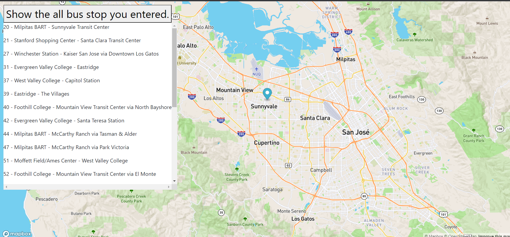
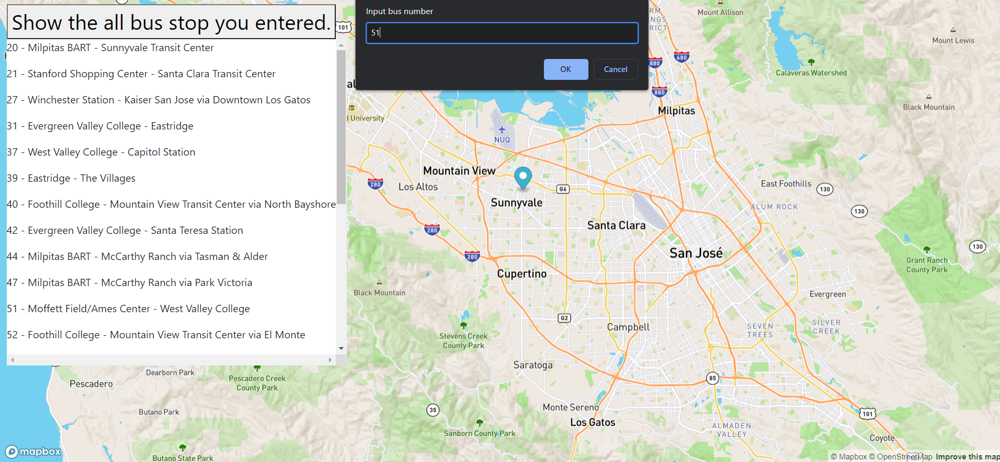

# -Real-Time-Bus-Tracker

  
## Description:
  This is assignment from ***Professional Certificate in Coding: Full Stack Development with MERN*** Week9.
  This program consists of javascript, html, and img files.
  This program search all of the busstop you entered.

## Installation:
  1. Downloads each file into one file.  
    1. **style.css**  
    2. **index.html**  
    3. **mapanimation.js**  
  2. Click **index.html** and run on the Web browser.
  
## Usage:
  
If successfully installed and run on the Web browser, you will be asked the number via console, and after entering the number, VTA bus stops appear. It move along with the route numbers.

  
## Support:
  If any question, message me via **[my twitter](https://twitter.com/Kojiro38895598)**.
  
## Roadmap:
  I will update so that bus move in one direction. Also, so far there is only local line, but I will add more line VTA produces.
  
## License information: 
 ***MIT***.
 Also, this program include the data from **[VTA_Data](https://gis.vta.org/gis/rest/services/Transit/BusRoutes_StopsJanuary2020_ODP/MapServer/0/query?where=1%3D1&outFields=*&outSR=4326&f=json)**, so if you use the data, please include the name of ***VTA***
